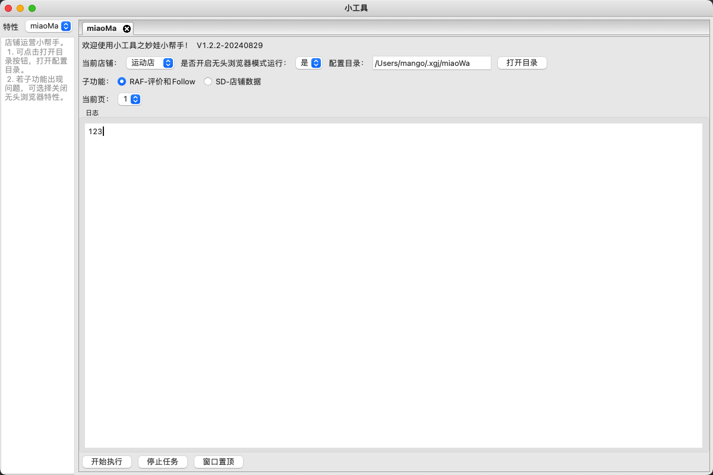

# XiaoGongJu-MiaoWa
在小工具的框架下，构建妙娃工具，来帮助运营速卖通店铺。

## 妙娃主功能
特性miao-wa
- [x] 基于配置文件来完成店铺的cookie登录 - 已实现
- [x] 基于json配置来管理多个店铺 - 已实现
- [x] 实现子功能RAF，维护评价和Follow - 已实现
- [x] 实现子功能SD，爬取店铺的评分和Follow信息存储到excel中 - 已实现
- [x] 基于spider来爬取店铺的可做评论和Follow的订单信息 - 已实现
- [x] 基于WxPython构建界面系统，实现妙娃工具来帮助运营速卖通店铺 - 已实现
- [x] 界面实现窗口置顶的切换功能 - 已实现
- [x] 基于logging模块来记录日志，并扩展WxTextCtrlHandler来输出日志到界面 - 已实现
- [x] 实现基于pyinstaller打包发布，支持selenium webdriver打包后正常运行 - 已实现
- [x] 配置化，将代码中Config中的配置信息提取出来，实现配置文件读取配置信息 - 已实现

### 待实现
- [ ] 优化，spider爬取的订单信息排除已超过时间无法评论的订单


## 环境安装
安装`python3.6`后执行安装依赖命令。
``` shell
pip install -r requirements.txt -i https://pypi.tuna.tsinghua.edu.cn/simple
```
如果出现报错，可以执行下如下语句，确保python工具集正常。
``` shell
python -m pip install --upgrade pip setuptools wheel -i https://pypi.tuna.tsinghua.edu.cn/simple
```

## 架构设计
利用4+1视图展现，主要关注用例图和类图。

### 用例图

### 逻辑图

### 组件图


## 目录结构
* src - 项目源码
  * model/future/miaowa - 利用wxPython构建界面系统，实现妙娃工具来帮助运营速卖通店铺
* app-miao-wa.py - wxPython的app入口
* dist - 打包后的代码
* doc - 文档
* miaowa - 妙娃配置目录
  * config.json - 主配置
  * logging.conf - 日志配置
  * sport/sport2 - 子店铺配置，下面可以放cookies.json

## 打包发布
``` shell
pip install pyinstaller
pyinstaller -F -w -i='logo.ico' --add-binary "/usr/local/bin/chromedriver:./" app-miao-wa.py
```

## 界面展示


