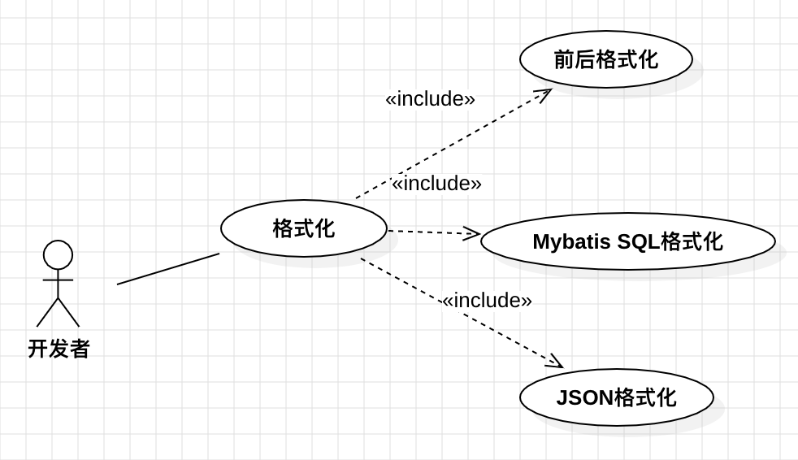

# XiaoGongJu
小工具积累

## 功能列表
### 格式化
- [x] 格式化文本，前后环绕补充指定内容 - 2023-12-31
- [x] 格式化JSON - 2023-12-31
- [ ] 格式化Mybatis SQL

## 环境安装
安装`python3.6`后执行安装依赖命令。
``` shell
pip install -r requirements.txt -i https://pypi.tuna.tsinghua.edu.cn/simple
```

## 架构设计
利用4+1视图展现，主要关注用例图和类图。

### 用例图

### 逻辑图

### 组件图


## 目录结构
* src - 项目源码
  * wxPython - 利用wxPython构建界面系统
  * command - 利用command框架来实现命令行
* app-cmd.py - cmd的app入口
* dist - 打包后的代码
* doc - 文档

## 打包发布
``` shell
pip install pyinstaller
pyinstaller -F -w -i='logo.ico' -D --add-data="images:images" app-wx.py
```

